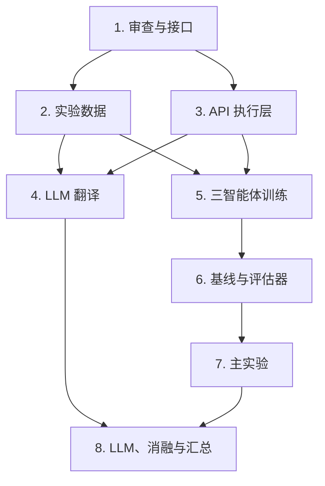

## 第一块：现有项目审查与统一接口

审查现有拓扑加载、OSPF、简化 BGP、ECMP、流量传播、策略检查、指标计算、三智能体和 COMA 实现，不修改代码；核对论文定义，找出缺失、错误和接口不一致，并确定拓扑、策略、流量、故障、配置、状态、动作、奖励和实验结果的统一数据结构。

**产出：**

- 现有功能清单；
    
- 问题与风险清单；
    
- 模块接口规范；
    
- 后续修改顺序。
    

---

## 第二块：Topology Zoo 与实验场景数据集构建

基于 Topology Zoo 筛选并标准化拓扑，按拓扑划分训练、验证和测试集；生成链路属性、初始 OSPF/BGP/Performance 配置、四类流量矩阵、三种负载等级以及 Forward、Reachable、Isolation 策略，构建静态 MADRL 场景和动态事件序列。

**产出：**

- 标准化拓扑数据；
    
- `topology_split.json`；
    
- 流量矩阵数据；
    
- 3,000 个训练场景；
    
- 500 个静态测试场景；
    
- 100 条动态事件序列；
    
- 数据统计和随机种子记录。
    

---

## 第三块：网络操作 API 与校验执行层

实现高层策略/事件 API 和显式配置 API，将 API 与现有仿真环境连接；增加 JSON Schema、参数范围、网络实体、策略冲突和调用顺序验证，确保非法调用不会修改环境。

**API 范围：**

- 策略：添加、删除 Reachable、Forward、Avoid、Isolation；
    
- 流量：设置流量、缩放流量、设置热点；
    
- 拓扑：链路/节点故障与恢复；
    
- 配置：OSPF、BGP、容量和队列参数；
    
- 控制：获取状态、启动多智能体优化。
    

**产出：**

- API 白名单；
    
- Schema 定义；
    
- API 执行器；
    
- 校验器；
    
- 结构化错误返回；
    
- API 单元测试。
    

---

## 第四块：自然语言数据集与 LLM 到 API 翻译

根据真实拓扑中的节点和链路，用模板生成约 2,000 条规范自然语言—API 标注数据，覆盖策略、流量、故障、恢复、显式配置、多操作及非法输入；接入 DeepSeek API，通过 system prompt、API 描述、few-shot 和结构化输出完成翻译，不微调模型。

**产出：**

- `train/validation/test.jsonl`；
    
- 自然语言模板库；
    
- DeepSeek API 客户端；
    
- Prompt 与 few-shot 示例；
    
- JSON 提取及失败重试；
    
- 自然语言到可执行 API 的完整流程。
    

---

## 第五块：轻量化三智能体模型与训练闭环

将图编码器调整为适合 RTX 4060 Laptop 的轻量结构：2 层 GCN/GINEConv、2 层 TransformerConv、hidden dimension 64、2 层 MLP；保留 OSPF、BGP、Performance 三智能体和 COMA，检查观测、动作掩码、奖励、反事实基线、回放缓冲、目标网络和模型保存机制。

**产出：**

- Debug 和 Experiment 两套配置；
    
- 轻量共享图编码器；
    
- 三个 Actor；
    
- 集中式 Critic；
    
- COMA 训练闭环；
    
- checkpoint、训练日志和收敛曲线；
    
- 单场景过拟合及多拓扑训练结果。
    

---

## 第六块：基线方法与统一评估框架

实现所有方法共用的评估入口、固定测试集、随机种子、日志和结果格式，并实现 No Update、Random、OSPF Default、Local Search OSPF 等基线，使各方法在相同拓扑、策略、流量和故障条件下比较。

**评估指标：**

- Policy Consistency；
    
- MLU；
    
- Traffic Shift；
    
- 配置修改比例；
    
- 成功率；
    
- 收敛/恢复步数；
    
- 运行时间。
    

**产出：**

- 统一评估器；
    
- 四种基线；
    
- 批量运行脚本；
    
- JSON/CSV 结果；
    
- `mean ± std` 统计。
    

---

## 第七块：静态、负载与动态适应实验

在未见测试拓扑上完成配置质量、负载优化、Traffic Shift 和动态适应实验。静态实验覆盖 Easy、Medium、Hard 策略规模；负载实验覆盖 Normal、Hotspot、Burst 和 High-load；动态实验连续注入策略变化、流量变化、链路故障、节点故障和可选策略冲突，每个事件后最多运行 30 步恢复。

**产出：**

- 静态配置质量结果；
    
- 不同负载下的 MLU 结果；
    
- Traffic Shift 结果；
    
- 动态事件前后指标曲线；
    
- 恢复步数、成功率和失败案例；
    
- 与四种基线的对比结果。
    

---

## 第八块：LLM 实验、三智能体消融与最终汇总

完成两类最终实验：一类评估 DeepSeek 对 API 名称、参数、完整调用、可执行性和语义目标的翻译效果；另一类对 OSPF、BGP、Performance 三个 Agent、COMA 协作方式及奖励项进行完整消融。最后生成表格、曲线和复现说明。

**LLM 对比：**

- Prompt-only；
    
- Prompt + Few-shot；
    
- Prompt + Few-shot + Schema 校验/一次反馈纠错。
    

**必做消融：**

- Full；
    
- OSPF-only；
    
- BGP-only；
    
- Performance-only；
    
- Full w/o OSPF；
    
- Full w/o BGP；
    
- Full w/o Performance；
    
- Independent Agents；
    
- Full w/o Traffic Shift reward。
    

**产出：**

- LLM 翻译准确率和可执行率；
    
- 三智能体消融结果；
    
- COMA 与独立智能体对比；
    
- 奖励消融结果；
    
- 最终实验表格和曲线；
    
- 运行说明、配置记录和复现结论。
    

---

整体依赖关系可以概括为：

这 8 块覆盖了数据、自然语言、DeepSeek API、环境 API、轻量化三智能体、COMA 训练、基线、静态实验、动态实验、LLM 翻译实验、完整消融和结果汇总，没有遗漏最终方案中的主要工作。