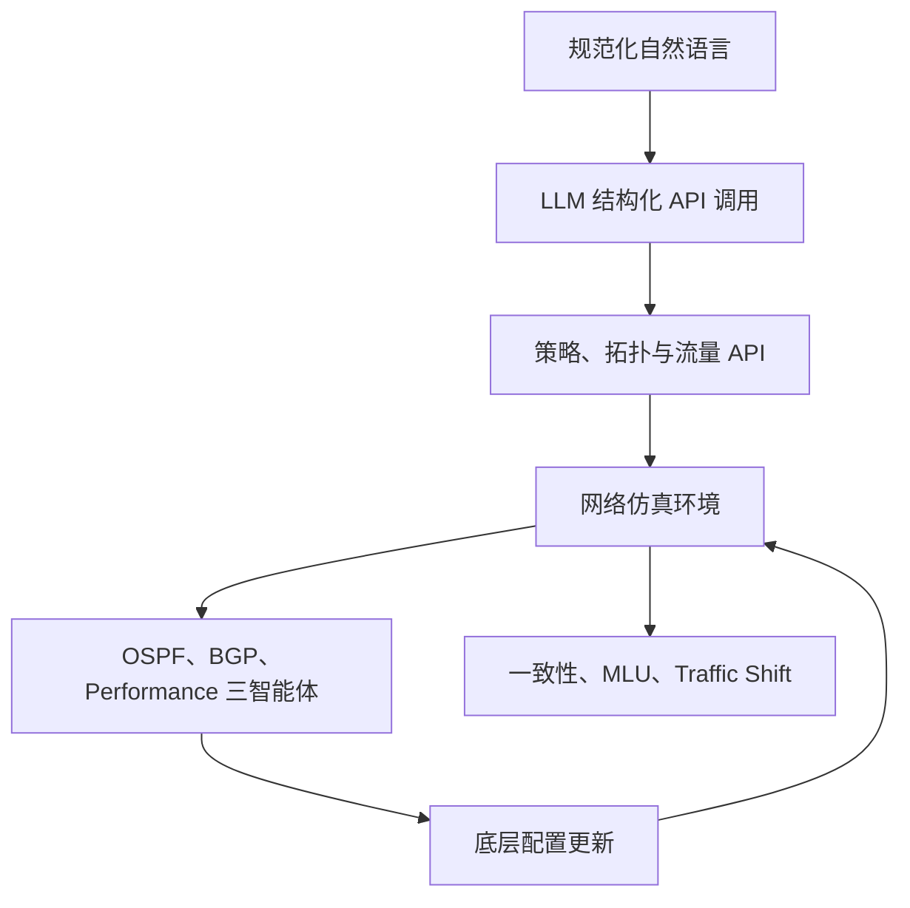

# 一、调整后的系统范围

整个系统分成四层：



## 1. 自然语言翻译层

输入是比较工整、接近 DSL 的自然语言，例如：

```text
请保证节点 R1 到 R8 可达。
将 R2 到 R9 的流量设置为必须经过 R5。
R3 到 R7 的流量不允许经过 R6。
将 R4 与 R10 隔离。
链路 R2-R5 发生故障。
将 R1 到 R9 的流量提高到原来的三倍。
将 R3-R6 的 OSPF 权重设置为 20。
```

LLM 不经过微调，通过：

- system prompt；
    
- API 描述；
    
- few-shot 示例；
    
- JSON Schema；
    
- function calling/tool calling；
    

直接生成 API 调用。

## 2. API 和环境层

API 负责把 LLM 的结果转换成环境能够执行的操作，例如：

```python
add_reachable_policy(src="R1", dst="R8")
add_forward_policy(src="R2", dst="R9", pass_node="R5")
add_avoid_policy(src="R3", dst="R7", avoid_node="R6")
add_isolation_policy(group_a=["R4"], group_b=["R10"])

set_traffic_scale(src="R1", dst="R9", scale=3.0)
set_link_state(src="R2", dst="R5", state="down")
set_node_state(node="R6", state="down")

set_ospf_weight(src="R3", dst="R6", weight=20)
set_bgp_local_pref(router="R1", prefix="P1", value=50)
```

## 3. 多智能体配置更新层

三个智能体全部保留：

- OSPF Agent；
    
- BGP Agent；
    
- Performance Agent。
    

三者共同优化：

- 策略一致性；
    
- 最大链路利用率；
    
- Traffic Shift；
    
- 配置修改规模。
    

## 4. 实验层

验证：

- LLM 是否正确调用 API；
    
- 多智能体是否生成有效配置；
    
- 三个智能体各自发挥了什么作用；
    
- 面对策略、流量和故障变化时能否恢复。
    

---

# 二、自然语言到 API 的实现方案

## 1. 建议采用“两类 API”

为了避免 LLM 与三个智能体的职责冲突，API 分成两类。

### A. 高层事件与策略 API

这类 API 只修改任务或环境，之后由三个智能体寻找具体配置。

```python
add_reachable_policy()
add_forward_policy()
add_avoid_policy()
add_isolation_policy()
remove_policy()

set_traffic_demand()
scale_traffic_demand()

set_link_state()
set_node_state()
add_link()
remove_link()

optimize_network()
get_network_state()
```

例如：

```text
输入：
保证 R1 到 R8 的流量经过 R5，并尽量降低网络最大链路利用率。

LLM 输出：
[
  {
    "api": "add_forward_policy",
    "arguments": {
      "src": "R1",
      "dst": "R8",
      "pass_node": "R5"
    }
  },
  {
    "api": "optimize_network",
    "arguments": {
      "objective": ["policy_consistency", "mlu", "traffic_shift"]
    }
  }
]
```

这是系统的主要工作流。

### B. 显式配置 API

当自然语言已经明确给出具体配置值时，允许 LLM 直接调用底层 API：

```python
set_ospf_weight()
set_bgp_local_pref()
set_bgp_as_path_length()
set_bgp_med()
set_link_capacity()
set_queue_length()
```

例如：

```text
将 R2-R6 的 OSPF 权重改成 30。
```

LLM 可以直接调用：

```json
{
  "api": "set_ospf_weight",
  "arguments": {
    "src": "R2",
    "dst": "R6",
    "weight": 30
  }
}
```

## 2. API 路由规则

建议明确规定：

|自然语言内容|处理方式|
|---|---|
|明确给出参数和值|LLM 直接调用配置 API|
|只描述可达、必经、避开、隔离|写入策略，交给三个 Agent 优化|
|描述流量升高、热点、拥塞|修改流量矩阵，交给 Agent 优化|
|描述链路或节点故障|更新拓扑，交给 Agent 恢复|
|同时包含多个要求|LLM 输出 API 调用列表|
|参数不完整或节点不存在|拒绝执行并返回错误|

这样既能实现“自然语言直接调用 API”，又能保留 MADRL 作为核心配置生成器。

---

# 三、LLM 输出格式和安全校验

不要让 LLM 生成任意 Python 代码或直接修改仿真器对象，而是只能从 API 白名单中选择。

推荐统一输出：

```json
{
  "request_id": "intent-000001",
  "calls": [
    {
      "api": "add_forward_policy",
      "arguments": {
        "src": "R1",
        "dst": "R8",
        "pass_node": "R5"
      }
    }
  ],
  "need_optimization": true
}
```

执行之前经过三层验证。

## 1. Schema 验证

检查：

- API 名称是否合法；
    
- 必填参数是否齐全；
    
- 参数类型是否正确；
    
- 数值是否在允许范围内。
    

## 2. 网络实体验证

检查：

- R1、R8 等节点是否存在；
    
- 链路是否存在；
    
- 节点是否已经失效；
    
- src 和 dst 是否相同；
    
- pass/avoid 节点是否合法。
    

## 3. 语义验证

检查：

- 权重是否在 `[1,64]`；
    
- LocalPref、AS Path、MED 是否在规定范围；
    
- 流量倍率是否大于 0；
    
- 不允许同时要求“经过 R5”和“避开 R5”；
    
- 不允许在不存在的链路上设置参数；
    
- 多个 API 是否相互冲突。
    

如果验证失败，不执行操作，返回：

```json
{
  "success": false,
  "error_type": "INVALID_NODE",
  "message": "Node R20 does not exist in the current topology."
}
```

---

# 四、基于 Topology Zoo 的数据集总体设计

现在不再生成一个单一的“监督学习 OSPF 标签数据集”，而是构建三个相互关联的数据集。

```text
NetKeeper-Lite Dataset
├── topology_dataset
├── intent_api_dataset
└── marl_scenario_dataset
```

它们分别用于：

1. 构建网络仿真环境；
    
2. 评估自然语言到 API 的翻译；
    
3. 训练和评估三个强化学习智能体。
    

---

# 五、拓扑基础数据集

## 1. 拓扑筛选

从 Topology Zoo 中筛选节点数 8～80、连通性较好的拓扑。

考虑 RTX 4060 Laptop 的算力，不建议一开始使用 125～170 节点的大型拓扑。

建议选择约 18～24 个拓扑：

|划分|拓扑数|节点范围|用途|
|---|--:|--:|---|
|Train|12～16|8～50|MADRL 训练|
|Validation|3～4|10～60|超参数和模型选择|
|Test|4～5|10～80|未见拓扑泛化测试|

必须按拓扑划分，不能把同一个拓扑生成的样本同时放入训练集和测试集。

## 2. 拓扑标准化

每个拓扑保存：

```json
{
  "topology_id": "Abilene",
  "nodes": [
    {
      "id": "R0",
      "original_label": "Seattle",
      "latitude": 47.6,
      "longitude": -122.3
    }
  ],
  "links": [
    {
      "src": "R0",
      "dst": "R1",
      "capacity_mbps": 10000,
      "delay_ms": 5.2,
      "ospf_weight": 10,
      "queue_length": 100,
      "state": "up"
    }
  ]
}
```

节点统一重命名为：

```text
R0, R1, R2, ...
```

保留原名称作为附加字段。自然语言数据主要使用统一节点名，可以显著降低 LLM 翻译难度。

## 3. 链路属性

可以复用现有数据集生成程序中的：

- `LinkSpeedRaw`；
    
- `LinkSpeed + Units`；
    
- `LinkType`；
    
- `LinkLabel`；
    
- 默认容量。
    

时延继续根据经纬度估算。缺少属性时使用统一默认值即可，不需要追求真实设备精度。

---

# 六、自然语言—API 数据集

这个数据集不用于微调，主要用于：

- prompt 示例；
    
- LLM 翻译准确率测试；
    
- 不同复杂度和异常输入测试。
    

建议生成约 2,000～3,000 条，其中测试集至少 500 条。

## 1. 单条数据结构

```json
{
  "intent_id": "intent-000001",
  "topology_id": "Abilene",
  "category": "forward_policy",
  "complexity": "single",
  "natural_language": "请让从 R1 到 R8 的流量经过 R5。",
  "expected_calls": [
    {
      "api": "add_forward_policy",
      "arguments": {
        "src": "R1",
        "dst": "R8",
        "pass_node": "R5"
      }
    }
  ],
  "need_optimization": true,
  "is_valid": true
}
```

## 2. 自然语言类别

### 策略类

|类别|示例|
|---|---|
|Reachable|保证 R1 可以到达 R8|
|Forward-pass|让 R1 到 R8 的流量经过 R5|
|Forward-avoid|让 R1 到 R8 的流量避开 R6|
|Isolation|将 R1 和 R8 隔离|
|Remove policy|删除 R1 到 R8 的可达策略|

### 流量类

|类别|示例|
|---|---|
|设置流量|将 R1 到 R8 的流量设置为 500 Mbps|
|流量倍增|将 R1 到 R8 的流量提高到三倍|
|热点|将 R5 设置为流量热点|
|全局高负载|将全网流量提高到正常状态的三倍|

### 故障类

|类别|示例|
|---|---|
|链路故障|链路 R2-R5 已经断开|
|链路恢复|恢复链路 R2-R5|
|节点故障|将 R6 标记为故障|
|节点恢复|恢复节点 R6|

### 显式配置类

|类别|示例|
|---|---|
|OSPF|将 R2-R5 的 OSPF 权重设置为 20|
|LocalPref|将 R1 对前缀 P2 的 LocalPref 设置为 50|
|AS Path|将 R3 对 P1 的 AS Path 长度设置为 4|
|MED|将 R4 对 P3 的 MED 设置为 10|
|Capacity|将链路 R2-R5 的逻辑容量设置为 1000 Mbps|

## 3. 语言难度划分

虽然自然语言可以比较工整，但仍应包含三种难度。

### Level 1：接近 DSL

```text
添加可达策略：源节点 R1，目的节点 R8。
```

### Level 2：规范自然语言

```text
请保证节点 R1 能够访问节点 R8。
```

### Level 3：多个操作组合

```text
断开链路 R2-R5，保证 R1 到 R8 仍然可达，并尽量降低最大链路利用率。
```

建议比例：

- Level 1：40%；
    
- Level 2：40%；
    
- Level 3：20%。
    

## 4. 无效和冲突数据

约 10%～15% 的测试数据应是异常输入：

```text
将不存在的节点 R99 与 R2 隔离。
将 R1-R5 的 OSPF 权重设置为 200。
让 R1 到 R8 的流量既经过 R5 又避开 R5。
断开不存在的链路 R3-R10。
```

期望结果不是调用 API，而是返回结构化错误。

这部分可以验证系统不会盲目执行 LLM 输出。

## 5. 数据生成方法

采用模板生成，不需要人工写几千条：

```python
templates = [
    "请保证节点 {src} 能够到达节点 {dst}。",
    "添加从 {src} 到 {dst} 的可达策略。",
    "要求 {src} 与 {dst} 之间保持连通。",
]
```

从具体拓扑中采样合法节点和链路，填充模板。

然后：

- 80% 使用固定模板生成；
    
- 20% 使用 LLM 对模板进行轻度改写；
    
- 人工抽查 100～200 条；
    
- 测试集中的部分表达模板不能出现在 few-shot 示例中。
    

---

# 七、MADRL 场景数据集

这个数据集没有“最优配置标签”，而是定义每个强化学习 episode 的初始环境。

## 1. 单场景结构

```json
{
  "scenario_id": "Abilene-train-00001",
  "topology_id": "Abilene",
  "split": "train",
  "initial_config": {
    "ospf_weights": {},
    "bgp_parameters": {},
    "link_parameters": {}
  },
  "policies": [
    {
      "type": "reachable",
      "src": "R1",
      "dst": "R8"
    },
    {
      "type": "forward",
      "src": "R2",
      "dst": "R7",
      "pass_node": "R5"
    }
  ],
  "traffic": {
    "pattern": "hotspot",
    "scale": 1.0,
    "matrix_file": "traffic/Abilene-00001.npy"
  },
  "failures": [],
  "max_steps": 50
}
```

## 2. 流量矩阵

继续使用现有的四种合成模式：

- gravity；
    
- diurnal；
    
- hotspot；
    
- burst。
    

负载等级：

|等级|流量倍率|
|---|--:|
|Low|0.5|
|Normal|1.0|
|High|3.0|

训练数据建议比例：

- gravity：30%；
    
- diurnal：20%；
    
- hotspot：25%；
    
- burst：25%。
    

## 3. 策略规模

由于使用轻量模型，可以先缩小策略规模：

|难度|三类策略数量|
|---|---|
|Easy|3×2|
|Medium|3×4|
|Hard|3×8|

`3×16` 可以只作为扩展测试，不建议作为主要训练场景。

## 4. 场景数量

建议第一版：

|数据划分|场景数|
|---|--:|
|Train|3,000～5,000|
|Validation|300～500|
|Test|500～800|

这些场景不需要一次全部加载到显存，可以保存为 JSONL，在 episode 开始时按需读取和构图。

也可以只保存随机种子和生成参数，训练时在线生成，以节省磁盘空间。

---

# 八、动态事件数据集

单独生成约 100～200 条动态事件序列，用于最终测试，不参与主训练。

## 1. 单条序列

```json
{
  "sequence_id": "dynamic-00001",
  "topology_id": "Pern",
  "initial_scenario": "Pern-test-001",
  "events": [
    {
      "event_id": "E1",
      "at_step": 0,
      "natural_language": "添加从 R1 到 R10 的可达策略。",
      "expected_api": "add_reachable_policy"
    },
    {
      "event_id": "E2",
      "at_step": 30,
      "natural_language": "将 R2 到 R8 的流量提高到三倍。",
      "expected_api": "scale_traffic_demand"
    },
    {
      "event_id": "E3",
      "at_step": 60,
      "natural_language": "链路 R4-R7 发生故障。",
      "expected_api": "set_link_state"
    }
  ]
}
```

## 2. 每条序列建议包含

- 2 个策略变化；
    
- 2 个流量变化；
    
- 1 个链路故障；
    
- 1 个节点故障；
    
- 可选 1 个策略冲突。
    

每次事件后给智能体最多 30 步恢复。

---

# 九、轻量化模型设计

考虑 RTX 4060 Laptop，一般是 8GB 显存，建议不要使用论文的 8+8 层网络。

## 1. 推荐模型

共享图编码器：

```text
2 层 GCN/GINEConv
+
2 层 TransformerConv
+
全局池化
+
2 层 MLP
```

参数建议：

|参数|建议值|
|---|--:|
|GNN 层数|2|
|Transformer 层数|2|
|Hidden dimension|64|
|Attention heads|2 或 4|
|Decoder 层数|2|
|Dropout|0.1|
|Batch size|4～8|
|最大节点数|第一阶段 50|
|Replay buffer|500～2000|
|Mixed precision|开启|
|梯度裁剪|1.0|

如果显存仍不足：

- hidden dimension 降到 32；
    
- batch size 降到 2～4；
    
- 不增加网络层数；
    
- 限制单个训练拓扑不超过 40 个节点；
    
- 将大拓扑仅用于逐个推理测试。
    

## 2. 推荐两套配置

### Debug

```yaml
hidden_dim: 32
gcn_layers: 2
transformer_layers: 1
heads: 2
batch_size: 2
max_steps: 20
episodes: 20
```

### Experiment

```yaml
hidden_dim: 64
gcn_layers: 2
transformer_layers: 2
heads: 4
batch_size: 4
max_steps: 50
episodes: 500
```

如果 500 episodes 训练时间过长，可以先跑 100～200 episodes，只要能够得到具有区分度的实验结果即可。

---

# 十、三个 Agent 的完整消融实验

你提出三个 Agent 都要做消融，这一点应该明确体现在实验矩阵里。

## 1. 单智能体消融

|模型|OSPF|BGP|Performance|
|---|--:|--:|--:|
|OSPF-only|✓|||
|BGP-only||✓||
|Performance-only|||✓|

作用：观察每个智能体单独能解决什么问题。

## 2. 双智能体消融

|模型|OSPF|BGP|Performance|
|---|--:|--:|--:|
|OSPF+BGP|✓|✓||
|OSPF+Performance|✓||✓|
|BGP+Performance||✓|✓|

作用：分析智能体之间的互补关系。

## 3. 完整模型

```text
OSPF + BGP + Performance + COMA
```

## 4. Leave-one-out 消融

这是最重要的一组：

|模型|被移除的智能体|
|---|---|
|Full|无|
|Full w/o OSPF|OSPF Agent|
|Full w/o BGP|BGP Agent|
|Full w/o Performance|Performance Agent|

## 5. 训练方式消融

在三个 Agent 都存在的前提下比较：

- Full COMA；
    
- 三个 Independent Agents；
    
- 共享编码器但不使用反事实基线；
    
- 不共享图编码器。
    

## 6. 奖励消融

在三个 Agent 都存在的前提下比较：

- 完整奖励；
    
- 去掉 MLU 奖励；
    
- 去掉 Traffic Shift 惩罚；
    
- 去掉配置修改惩罚；
    
- 去掉动态奖励，只保留静态策略满足奖励。
    

---

# 十一、消融实验不需要全部重新训练

如果每组都从头训练，会给 4060 Laptop 带来较大负担。可以把实验分成两级。

## 必做实验

需要独立训练：

1. Full；
    
2. OSPF-only；
    
3. BGP-only；
    
4. Performance-only；
    
5. Full w/o OSPF；
    
6. Full w/o BGP；
    
7. Full w/o Performance；
    
8. Independent Agents；
    
9. Full w/o Traffic Shift reward。
    

共 9 组。

## 可选实验

如果时间足够再做：

- 三种双智能体组合；
    
- 无 MLU 奖励；
    
- 无配置修改惩罚；
    
- 不共享编码器；
    
- 不同层数。
    

调试阶段每组先训练 50～100 episodes。只有能够正常收敛的配置才跑 300～500 episodes。

---

# 十二、LLM 翻译实验

LLM 部分独立于强化学习评估。

## 1. 指标

### API Name Accuracy

调用的 API 名称是否正确。

### Argument Accuracy

所有参数是否正确，包括节点、链路、数值和状态。

### Exact Match

完整 API 调用是否与标注完全相同。

### Execution Success Rate

生成结果能否通过 Schema 和环境验证并成功执行。

### Semantic Success Rate

执行后是否实现自然语言目标。

对于多 API 输入，再计算：

- Precision；
    
- Recall；
    
- F1。
    

## 2. 实验条件

建议比较：

|方法|API 描述|Few-shot|Schema 验证|
|---|--:|--:|--:|
|Prompt-only|✓|||
|Prompt + Few-shot|✓|✓||
|完整方案|✓|✓|✓|

不需要比较很多 LLM。使用一个支持结构化输出或 function calling 的模型即可。

为了降低调用成本，可以选择：

- 一个较小的云端模型；
    
- 或一个能稳定输出 JSON 的本地模型。
    

核心不是比较模型能力，而是证明规范自然语言能够可靠映射为 API。

---

# 十三、完整实验安排

最终建议安排六组实验。

## 实验 1：LLM 到 API 翻译

回答：

> 不微调 LLM，是否能够把规范自然语言正确映射为网络 API？

## 实验 2：静态配置质量

回答：

> 三智能体能否满足 Forward、Reachable、Isolation 策略？

## 实验 3：网络负载优化

回答：

> 在 Normal、Hotspot 和 High-load 下能否降低 MLU？

## 实验 4：Traffic Shift

回答：

> 配置更新是否造成较小的转发表变化？

## 实验 5：动态适应

回答：

> 策略、流量、链路和节点变化后，模型需要多少步恢复？

## 实验 6：三个 Agent 消融

回答：

> OSPF、BGP、Performance Agent 分别贡献了什么，COMA 是否促进了协作？

---

# 十四、最终推荐的数据目录

```text
data/
├── topologies/
│   ├── raw/
│   ├── normalized/
│   └── topology_split.json
├── traffic/
│   ├── train/
│   ├── validation/
│   └── test/
├── intents/
│   ├── train.jsonl
│   ├── validation.jsonl
│   ├── test.jsonl
│   └── api_schema.json
├── scenarios/
│   ├── train.jsonl
│   ├── validation.jsonl
│   └── test.jsonl
├── dynamic_sequences/
│   └── test.jsonl
└── metadata/
    ├── generation_config.yaml
    ├── dataset_statistics.json
    └── random_seeds.json
```

其中：

- `intents/train.jsonl` 不是用于微调，而是保存 few-shot 候选和开发样例；
    
- `intents/test.jsonl` 用于 LLM 翻译测试；
    
- `scenarios/train.jsonl` 用于 MADRL episode；
    
- `dynamic_sequences/test.jsonl` 用于动态适应实验；
    
- 原来的 OSPF 局部搜索标签可以保留为基线数据，但不再是主数据集。
    

---

# 十五、调整后的最小可行版本

如果目标只是可靠跑出结果，可以采用下面的最终范围：

- 12 个训练拓扑、3 个验证拓扑、4 个测试拓扑；
    
- 拓扑节点数主要控制在 8～50；
    
- 2 层 GNN + 2 层 Transformer，hidden dimension 64；
    
- OSPF、BGP、Performance 三智能体；
    
- Easy 和 Medium 策略规模作为主实验；
    
- 2,000 条自然语言—API 数据；
    
- 3,000 个 RL 训练场景；
    
- 500 个静态测试场景；
    
- 100 条动态事件序列；
    
- LLM 使用 prompt + few-shot + JSON Schema，不微调；
    
- 必做 9 组智能体及奖励消融；
    
- 基线使用 No Update、Random、OSPF Default、Local Search OSPF；
    
- 指标使用 API Accuracy、Policy Consistency、MLU、Traffic Shift、恢复步数。
    

这套方案与原论文核心思想一致，同时把规模压缩到了 4060 Laptop 可承担的范围。最需要优先保证的是端到端闭环：

```text
自然语言
→ LLM API
→ 环境变化
→ 三智能体更新配置
→ 策略和性能指标改善
```

只要这条链路跑通，再加上三智能体消融与动态事件实验，就已经是一套完整、可解释且可复现的实验方案。